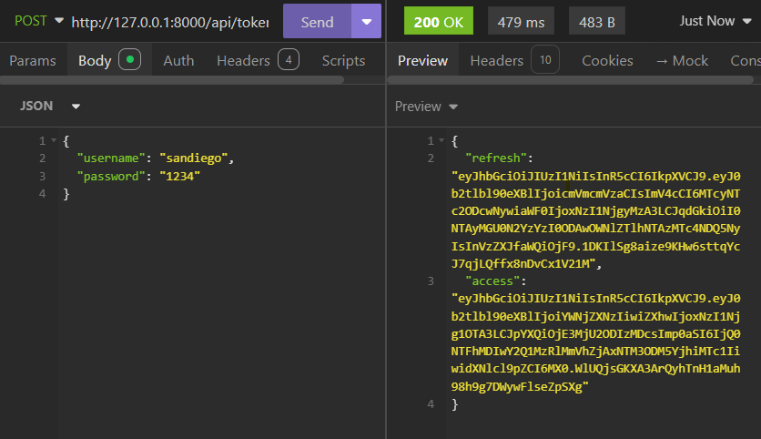
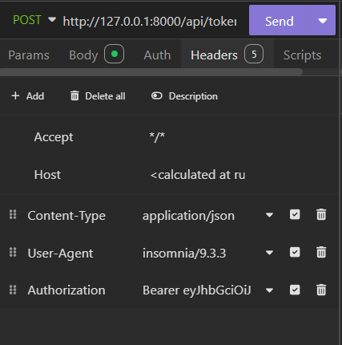
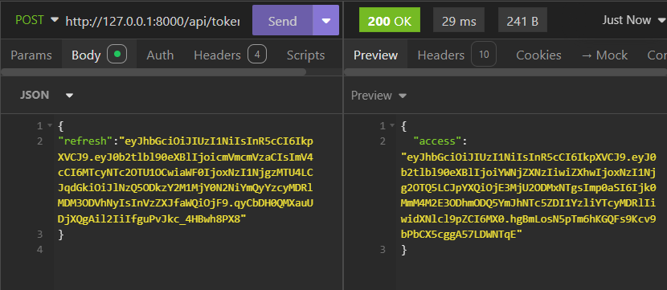
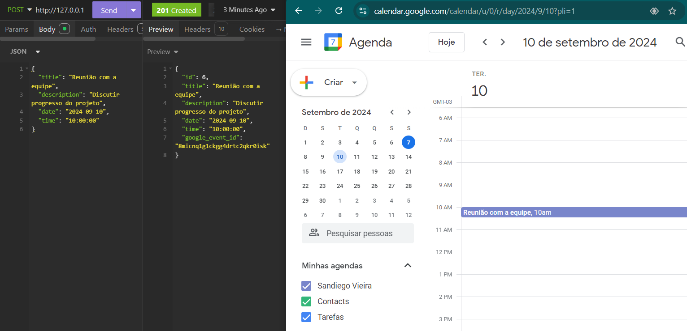
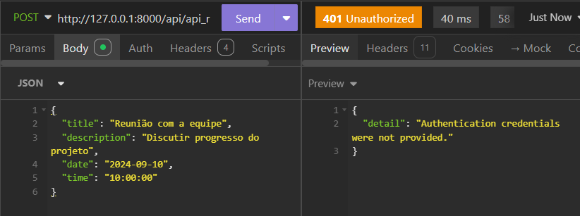
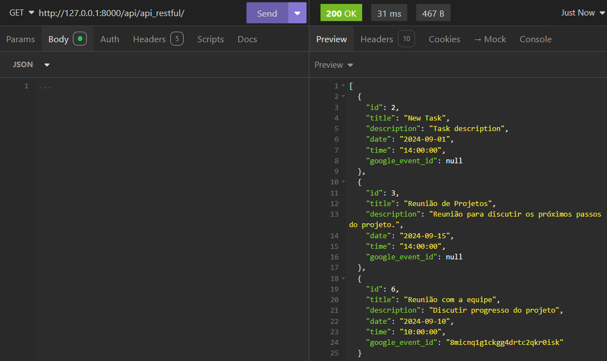
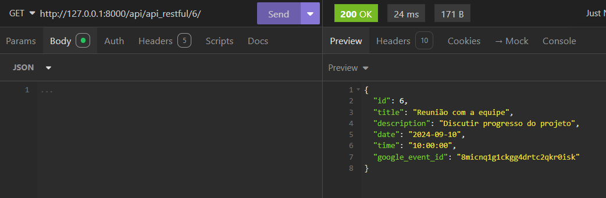
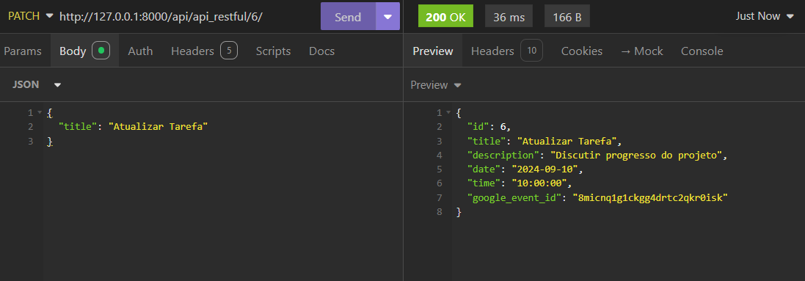
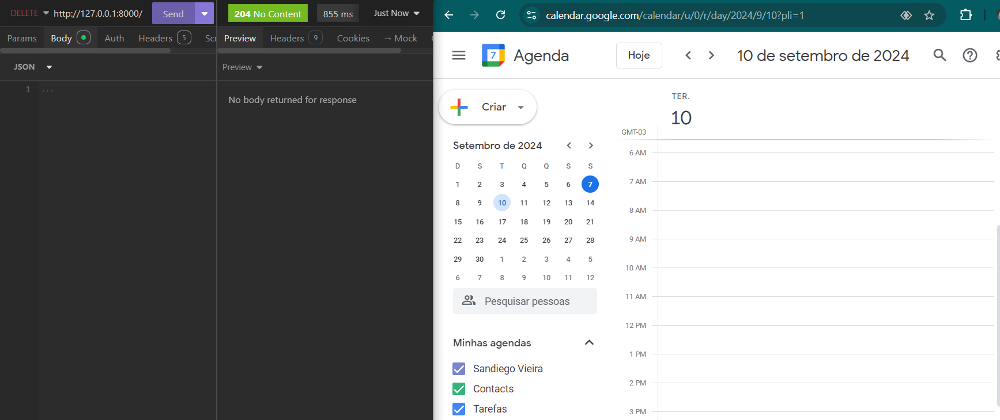
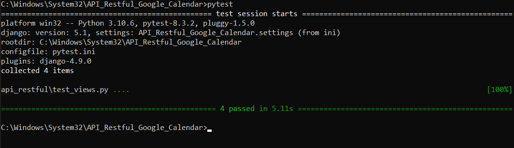

# API Restful com Django e Integração com Google Calendar

## Descrição

Este projeto é uma API Restful desenvolvida em **Django** utilizando **Django Rest Framework** com funcionalidades CRUD para gerenciar tarefas. A API está integrada com o **Google Calendar**, permitindo a criação e exclusão de eventos no Google Calendar quando tarefas são criadas ou excluídas. A API também utiliza **JWT (JSON Web Token)** para autenticação e proteção de endpoints.

## Funcionalidades

- Gerenciamento de tarefas (CRUD completo: criar, ler, atualizar, excluir).
- Integração com Google Calendar para criação e exclusão de eventos.
- Autenticação JWT para proteger endpoints.
- Testes TDD implementados com `pytest`.
- API validada via **Insomnia**.

## Requisitos :computer:

- Python 3.6 ou superior
- Django 5.1
- Django Rest Framework
- Google API Client
- Django Rest Framework SimpleJWT
- pytest

## Configuração do Projeto :books:

### 1. Clonar o Repositório

*Clone o repositório para sua máquina local:*

```
git clone https://github.com/seu-usuario/seu-repositorio.git
cd seu-repositorio
```
## 2. Criar e Ativar o Ambiente Virtual

```
python -m venv venv
source venv/bin/activate  # Linux ou Mac
venv\Scripts\activate  # Windows
```
## 3. Instalar as Dependências
*Instale todas as dependências necessárias usando o pip:*
```
pip install -r requirements.txt
```
### 4. Configuração do Google Calendar

1. Acesse o [Google Cloud Console](https://console.cloud.google.com/).
2. Crie um novo projeto ou use um existente.
3. Ative a **Google Calendar API** buscando em **APIs e Serviços>Biblioteca**.
4. Crie **credenciais OAuth 2.0**(em credencias>+ criar credenciais) e baixe o arquivo e renomei para `credentials.json`.
5. Coloque o arquivo `credentials.json` na raiz do projeto, ao lado do arquivo `manage.py`.
6. Em **Tela de permissão OAuth** selecione usuário externo, preencha os campos obrigatiorios e adicione um usuario de preferencia o e-mail da conta google que ira usar para autenticação.
7. (foi escolhido usuário externo a fim de praticidade e devido ser preciso workspace para interno)

*5- Coloque o arquivo credentials.json na raiz do projeto, ao lado do arquivo manage.py.*
## 5. Configurar o Banco de Dados
*Rode as migrações para criar as tabelas no banco de dados SQLite:*
```
python manage.py migrate
```
## 6. Criar Superusuário (Opcional)
*Para acessar o Django Admin, crie um superusuário:*
```
python manage.py createsuperuser
```
*Siga as instruções para definir o nome de usuário, email e senha.*
## 7. Iniciar o Servidor
```
python manage.py runserver
```
*A API estará disponível em `http://127.0.0.1:8000/`.*
### Autenticação JWT
*A API usa JSON Web Tokens (JWT) para autenticação.*
## 1. Obter o Token de Acesso e de Atualização
*Para obter o token JWT, envie uma requisição POST para o endpoint /api/token/ com suas credenciais (nome de usuário e senha):*

-Endpoint: `http://127.0.0.1:8000/api/token/`

-Método: POST

-Corpo da Requisição (JSON):
```
{
  "username": "seu_usuario",
  "password": "sua_senha"
}
```


*A resposta incluirá um access token e um refresh token.*
### 2. Usar o Token para Acessar Endpoints Protegidos
*Inclua o token no cabeçalho Authorization das suas requisições para acessar os endpoints protegidos.*
# No Cabeçalho(headers):
```
Authorization: Bearer <seu_access_token>
```

### 3. Atualizar o Token de Acesso
*Quando o access token expirar, use o *refresh token* para obter um novo ou também poderá realizar um novo POST de acesso para gerar novo token:*

-Endpoint: `http://127.0.0.1:8000/api/token/refresh/`

-Método: POST

-Corpo da Requisição (JSON):
```
{
  "refresh": "<seu_refresh_token>"
}
```

### Testes com Insomnia
*Aqui estão as etapas para testar a API usando o Insomnia:*
# 1. Criar uma Tarefa (POST)

-Endpoint: `http://127.0.0.1:8000/api/api_restful/`

-Método: POST

-Cabeçalhos: Adicionar o cabeçalho `Authorization: Bearer <seu_access_token>`

-Corpo da Requisição (JSON):
```
{
  "title": "Reunião com a equipe",
  "description": "Discutir progresso do projeto",
  "date": "2024-09-10",
  "time": "10:00:00"
}
```
*Além de trazer o post realizado, com a integração ao google calendar será atualizado no calendário, em primeiro acesso será direcionado para login em conta google, garanta de logar na conta de usuário teste adicionada na configuração google cloud informada anteriormente*

*Exemplo de caso tente acessar sem token de access ou com token expirado ira obter este retorno*

# 2. Listar Tarefas (GET)

-Endpoint: `http://127.0.0.1:8000/api/api_restful/`

-Método: GET

-Cabeçalhos: Adicionar o cabeçalho `Authorization: Bearer <seu_access_token>` 

# 3. Buscar Tarefa por ID (GET)

-Endpoint: `http://127.0.0.1:8000/api/api_restful/{id}/`

-Método: GET

-Cabeçalhos: Adicionar o cabeçalho `Authorization: Bearer <seu_access_token>`

# 4. Atualizar Tarefa (PUT ou PATCH)

-Endpoint: `http://127.0.0.1:8000/api/api_restful/{id}/`

-Método: PATCH

-Cabeçalhos: Adicionar o cabeçalho `Authorization: Bearer <seu_access_token>`

-Corpo da Requisição (JSON):
```
{
  "title": "Atualizar Tarefa"
}
```

# 5. Excluir Tarefa (DELETE)

-Endpoint: `http://127.0.0.1:8000/api/api_restful/{id}/`

-Método: DELETE

-Cabeçalhos: Adicionar o cabeçalho `Authorization: Bearer <seu_access_token>`


### Testes Automatizados (TDD)
*Para rodar os testes automatizados que foram implementados com pytest, siga os passos:*
# 1. Executar os Testes
*Rode os testes TDD que verificam as funcionalidades do CRUD e integração com Google Calendar:*
`pytest`
*Se tudo estiver configurado corretamente, você verá a mensagem de sucesso indicando que os testes passaram.*

### Considerações Finais
***Esta API Restful foi desenvolvida com foco em facilitar o gerenciamento de tarefas, utilizando o Google Calendar para integração de eventos e protegendo endpoints sensíveis com JWT. O sistema foi desenvolvido utilizando boas práticas como TDD (Test-Driven Development) para garantir sua estabilidade.***
# Autor
<table>
  <tr>
    <td align="center">
      <a href="#" title="defina o título do link">
        <br>
        <sub>
          <b>Sandiego Vieira</b>
        </sub>
      </a>
    </td>
     </tr>
</table>


